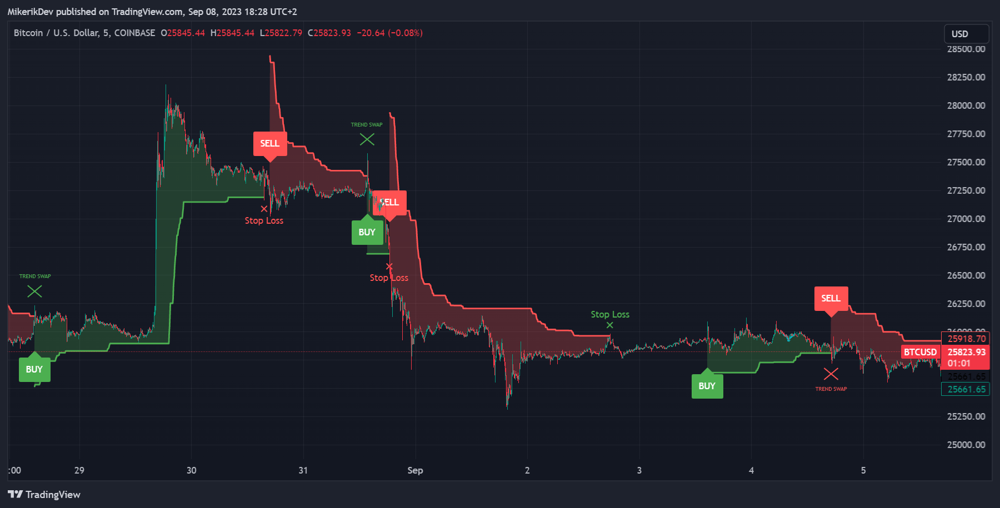

# ATR-SB Indicator
ATR-Sell/Buy Indicator which works based on calculating the "trend line" from each candle's close price, ATR (average true range) and complex formula connected to it. Sell/Buy signal starts to occur when the trend line crosses with each candle close price.

## Indicator Visualization

## Change log
* 1.0 - Initial push
* 1.1 - Readme edited, Title of the indicator changed
* 1.2 - Added filling, trendline edited, UI and tips added

## Credits
This indicator is inspired by "UT Bot" indicator. My code basically works on it, but I created my version of it. If you want to get some more information about this indicator click [here](https://theforexgeek.com/ut-bot-alerts-indicator/)