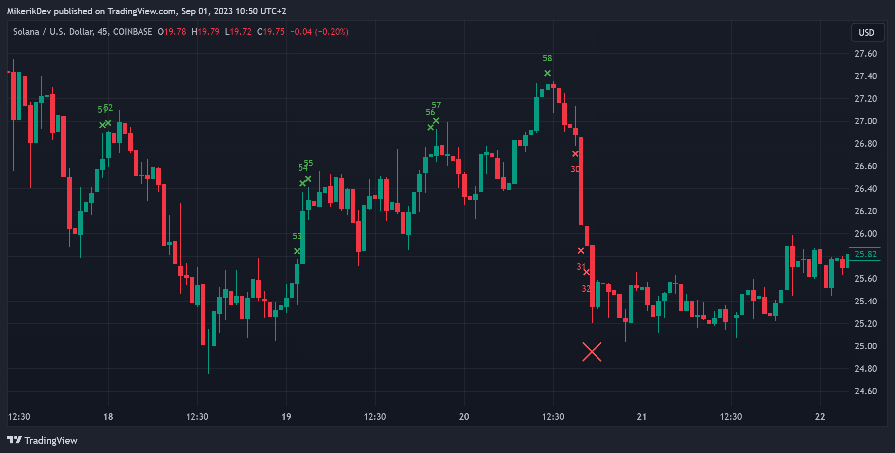

# Sequence Indicator
This indicator is highlighting an in-row sequences of green/red candles. If there are more than 5 green/red candles in row, a small cross
appears either above or below the bar, depending on whether the candle is green or red. If there are more than 4 green/red small crosses in row, the
larger crosses will begin to appear.

## Indicator Visualization

