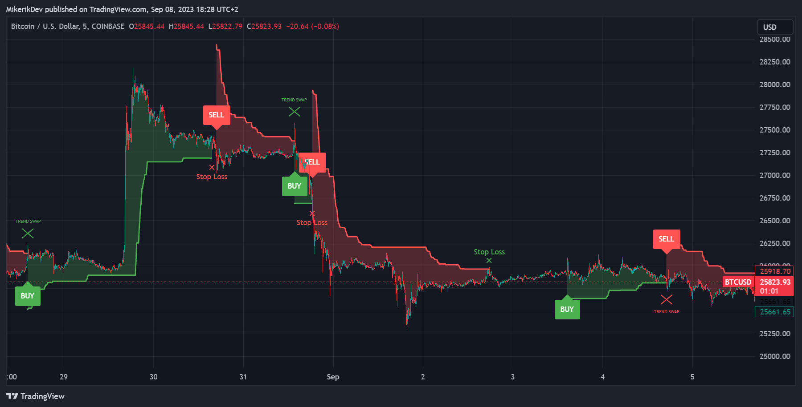

# ATR-SB AI-Algo
* ATR-SB AI-Algo is an indicator which works based on calculating the "trend line" from each candle's close price (EMA1) and ATR (average true range). This algorithm starts displaying sell/buy signals based on complex mathematical formulas.

* You can check this indicator out on [this chart](https://www.tradingview.com/chart/dAfm1Hmv/?symbol=BINANCE%3ABTCUSD)

## Indicator Visualization

## Change log
* 1.0 - Initial push
* 1.1 - Readme edited, Title of the indicator changed
* 1.2 - Added filling, trendline edited, UI and tips added
* 1.3 - Trendline invisible while crossing SB candle, added option to show or hide SB labels
* 1.4 - Stoploss attempt - not working yet
* 1.5 - Stoploss fixed - only one signal per each SB signal
* 1.6 - Stoploss appearance changed
* 1.7 - Stoploss fixed
* 2.0 - Indicator mostly done, first public release, all works without bugs (hopefully)
* 2.1 - The whole folder adjusted only for this very indicator
* 2.1.1 - Change of some variable names
* 2.2 - Strategy connected to indicator variables

## Released Versions
* 2.0 - First public release

## To Do List
* Merge it with Consolidation Zones indicator
* Make strategy for this indicator
* Trend swap does not count as sl - fix needed

## Credits
This indicator is inspired by "UT Bot" indicator. My code basically works on it, but I created my version of it. If you want to get some more information about this indicator click [here](https://theforexgeek.com/ut-bot-alerts-indicator/).
