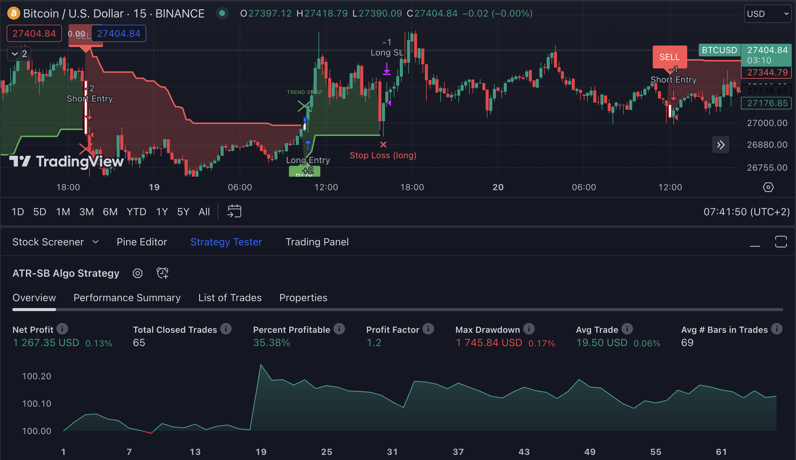

# ATR-SB AI-Algo
* ATR-SB AI-Algo is an indicator which works based on calculating the "trend line" from each candle's close price (EMA1) and ATR (average true range). This algorithm starts displaying sell/buy signals based on complex mathematical formulas.

* You can check this indicator out on [this chart](https://www.tradingview.com/chart/dAfm1Hmv/?symbol=BINANCE%3ABTCUSD)

## Indicator Visualization

## Released Versions
* 2.0 - First public release (indicator only)
* 3.0 - Strategy added for the 2.0 indicator release

## To Do List
- [x] Stop loss plot
- [x] Make strategy for this indicator
- [x] Trend swap does not count as sl
- [ ] Merge it with Consolidation Zones indicator

## Credits
This indicator is inspired by "UT Bot" indicator. My code basically works on it, but I created my version of it. If you want to get some more information about this indicator click [here](https://theforexgeek.com/ut-bot-alerts-indicator/).
